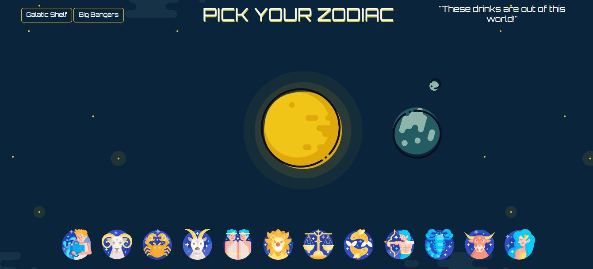

# Cosmic Cocktail Generator Application

## Description
The Cosmic Cocktail Generator is an interactive application that produces a generated cocktail based on the user's zodiac sign. 

[Cosmic Cocktail Generator](https://putmylinkhere)

## Installation
n/a

## Usage
When you load the application, you are presented with an interactive page where you can click on links to view stored cocktails (The Galactic Shelf) and the top five cocktails (Big Bangers). You are also presented with a choice of zodiac signs. When you choose a zodiac sign, you are presented with a user creation page which displays a randomly generated space themed background image along with the generated cocktail and it's ingredients and instructions. If you want to generate a new cocktail, you may press the button to try again. When you are finished generating cocktails, your choice(s) is added to local storage (The Galactic Shelf).

## Screenshot

## Credits
### A Stellar Project by Group 3:
[Daniel Grayson](https://github.com/GrayCoded)

[Jacob Lowther](https://github.com/YggdrasilJL)

[Farrah Hodgson](https://github.com/Firene11)

### Images
gifer.com

### API
Nasa API

The Cocktail DB

## License
Please refer to the LICENSE in the repo.
